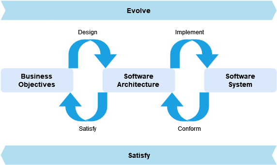
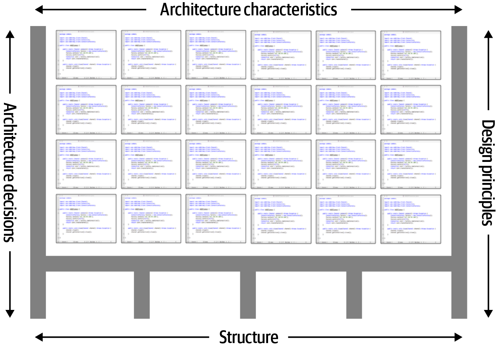
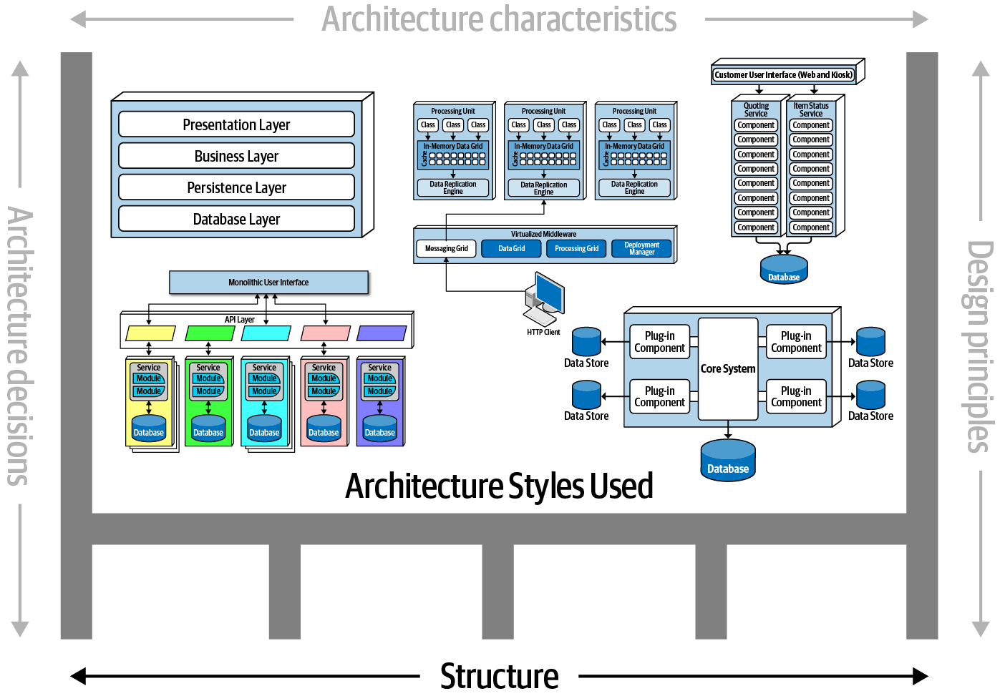
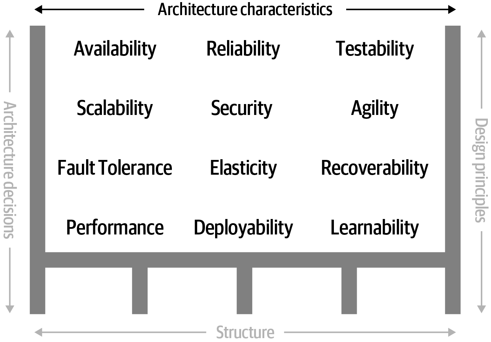
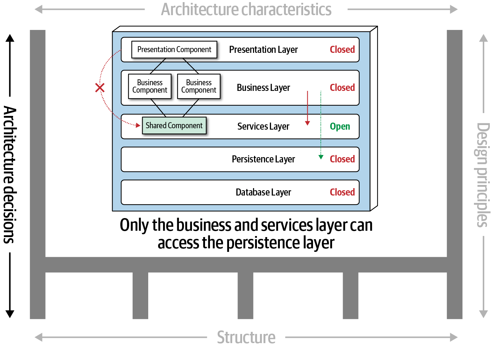
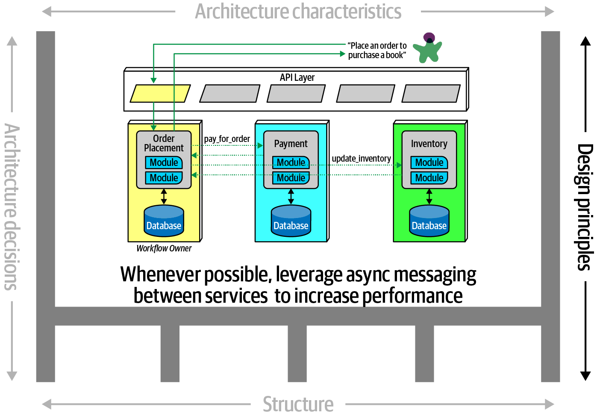
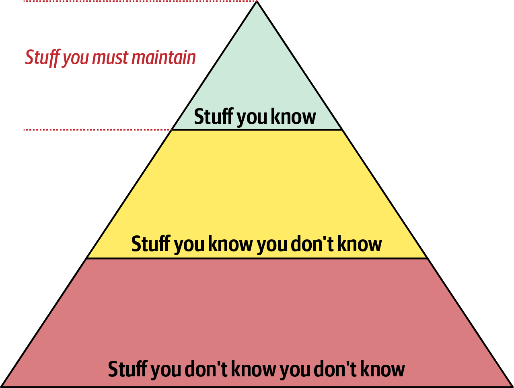
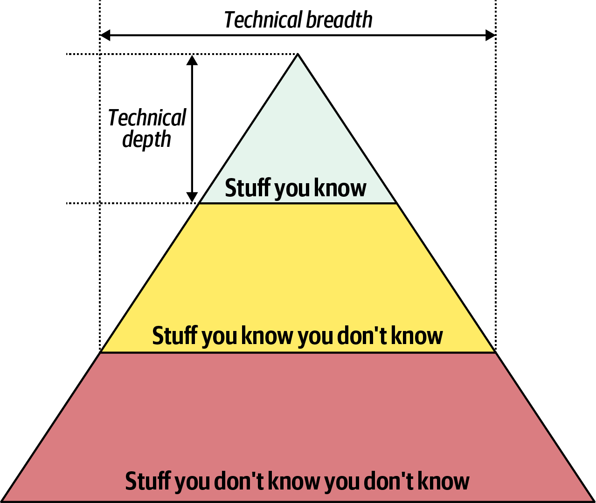
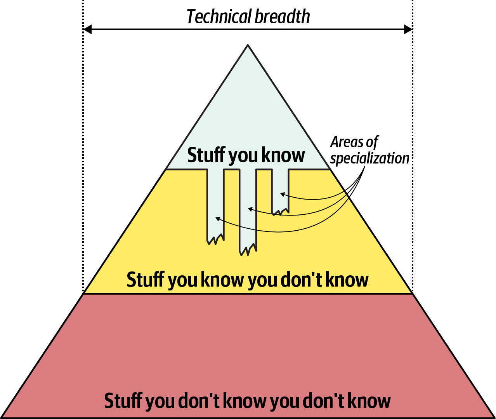

# ¿Arquitectura de Software? 

:::notes
A European city. Original public domain image from Wikimedia Commons.
Title Image credits: [Rawpixel.com](https://www.rawpixel.com/image/3285415)
:::

## {data-menu-title="según Fowler & Johnson"} 

> Architecture is about the important stuff. Whatever that is.

::: {style="text-align: right"}
Ralph Johnson, citado en [@fowler2003]
:::

 

> Architecture is a social construct, a shared understanding of the system. It doesn't just depend on the software, but on what part of the software is considered important by group consensus.

::: {style="text-align: right"}
Ralph Johnson, citado en [@fowler2003]
:::

## {data-menu-title="según Tai"}

> Software architecture can be seen as the centrepiece sitting between the business goals and the software system that supports the business to meet these goals.

::: {style="text-align: right"}
[@tai2022]
:::

. . .

{fig-align="center" width=65%}

:::notes
An architect would create just enough design for implementation to satisfy business needs. The idea here is that as the world changes, so do the business requirements. This should be an iterative process. he software architecture should support the business to adopt changes by evolving with the requirements.

Image credits: [@tai2022]
:::

## {data-menu-title="según Richards"} 

> Arquitectura de software es algo difícil de definir, depende del escenario/proyecto, y de todo lo que se considera importante para el éxito del proyecto.

::: {style="text-align: right"}
[@richards2020]
:::

## Libro de referencia

::: columns
::: column

{width="65%"}
:::

::: column

### By Mark Richards and Neal Ford

### January 2020

Capítulos 1 y 2 [@richards2020]

:::
:::

# ¿Cómo caracterizamos una Arquitectura Software?

##  Dimensiones de la arquitectura [@richards2020]

{fig-align="center" width="70%"}

:::notes

Image credits: [@richards2020]
:::

## Estructura

 Estilo(s) de la arquitectura, i.e., organización lógica de las partes (por capas, microservicios, etc.)

## Estructura - ejemplos

{fig-align="center" width="70%" }

:::notes

Image credits: [@richards2020]
:::

## Características de la arquitectura 

 Criterios y/o requisitos para el funcionamiento correcto del sistema (ortogonal a la funcionalidad)

## Características - ejemplos 

{fig-align="center" width="70%"}

:::notes

Image credits: [@richards2020]
:::

## Decisiones de la arquitectura 

 Reglas y/o restricciones (tajantes) del sistema, i.e. qué se puede y no se puede hacer

## Decisiones - ejemplos

{fig-align="center" width="70%"}

:::notes

Image credits: [@richards2020]
:::

## Principios de diseño 

 Guías, recomendaciones o preferencias (en contraposición a las *reglas tajantes* como las decisiones)

## Principios de diseño - ejemplos

{fig-align="center" width="70%"}

:::notes

Image credits: [@richards2020]
:::

# ¿Qué tareas desempeña un/a Arquitecto/a de Software?

:::notes

Las tareas de un persona programadora o analista son más conocidas. Incluso, hay especializaciones, como programador *back-end*, *front-end*, of *full-stack*. ¿Qué tareas desempeña una persona con el rol de *Software Architect*?
:::

## {data-menu-title="Analogía" background-image="images/architect.jpg" background-size="cover"}

:::notes

Analogy: The building architect creates the blueprint of the building. The engineers build it physically and make it work according to the blueprint. Yet, this is a poor analogy to define what Software Architecture is because the building analogy makes people focus too much on the static aspects of the system. Source: [@tai2022]

Similar analogy: One of the differences between building architecture and software architecture is that a lot of decisions about a building are hard to change. It is hard to go back and change your basement, though it is possible. Source: [@fowler2003]

Home Decor Renovation Style Architecture Building Image by [rawpixel.com](https://www.rawpixel.com/image/65068)
:::

## {data-menu-title="Analogía (II)" background-image="images/nyc.jpg" background-size="cover"}

:::notes

Analogy (continue): The creation of a city is a better analogy since it involves both static elements like roads, buildings and bridges, and dynamic elements like traffic flows and people living in the city. The architect is the person who comes up with the design of the city, the plan of how it should be built, and how everything is going to fit together. The city architect has a vision of how the city would **evolve**. Source: [@tai2022]

New York city Image by [rawpixel.com](https://www.rawpixel.com/image/5959681)
:::

## Arquitecto vs. Desarrollador {.center}

{fig-align="center" width="60%"}

:::notes

Pirámide del conocimiento. Un desarrollador, al principio de su carrera, se centra en la parte alta de la pirámide, para adquirir experiencia y conocimiento técnico, y también para manternerse actualizado sobre lo que sabe. 

Image credits: [@richards2020]
:::

## Arquitecto vs. Desarrollador (II) {.center}

{fig-align="center" width="55%"}

:::notes

Pirámide del conocimiento: profundidad vs. amplitud técnica. Lo que uno sabe es *technical depth*, y lo mucho que uno abarca o sabe es *technical breadth*. 

Image credits: [@richards2020]
:::

## Arquitecto vs. Desarrollador (III) {.center}

::: columns
::: column

### Arquitecto   

*breadth*  *depth*

Architect should know what **should be done** to create a platform/product **in the right way** [@francis2022]

:::

::: column
### Desarrollador  

*depth*  *breadth*

Developer knows what **can be done** to create a platform/product [@francis2022]

:::
:::

. . .

::: {.callout-important}
## **Recuerda** 

A Software Architect needs a **broad** and **deep** knowledge of almost everything in order to accomplish the business goals [@tai2022]

:::

:::notes

Source: [What it takes to become a software architect](https://ayltai.medium.com/what-it-takes-to-become-a-software-architect-fa7788962c8c)
:::

## Arquitecto  breadth  depth

{fig-align="center" width="55%"}

:::notes

Pirámide del conocimiento: El arquitecto se especializa en algunas áreas de interés del proyecto. Sacrifica profundidad técnica en aras de tener una visión más amplia.
Image credits: [@richards2020]
:::

## ¿Qué roles desempeña un/a arquitecto/a {.smaller}

::: incremental

- **GUÍA**: decisiones de arquitectura, principios de diseño, estructura...

- **CAMBIO**: Analiza continuamente y recomienda mejoras

- **VISIÓN**: Esta al día con (y expuesto a) las últimas tendencias

- **LIDERAZGO**: Se asegura que la implementación sigue las decisiones/principios

- **SÍNTESIS**: Integra conocimiento de dominio de negocio y técnico 

- **MENTORING**: Posee habilidades de comunicación, trabajo en equipo, soft skills

:::

# Leyes de Arquitectura de Software

## The First Law of Software Architecture

> Everything in software architecture is a **trade-off**.

::: {style="text-align: right"}
Mark Richards & Neal Ford [@richards2020]
:::

. . .

 

 There’s no perfect solution — only choices with consequences. The only constant in software is change.

 Evaluate trade-offs consciously. Every architectural decision affects the system’s behavior, flexibility, and cost.

 The only constant in software is change.

## The Second Law of Software Architecture

> **Why** is more important than how.

::: {style="text-align: right"}
Mark Richards & Neal Ford [@richards2020]
:::

. . .

 

 Essential for well-informed decisions. 

 Understanding the rationale behind our choices allows us to reevaluate them when needed and retain valuable knowledge.

# Referencias {.scrollable}