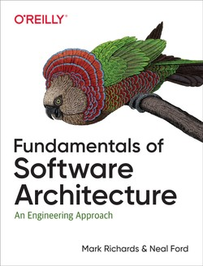

# ¿Qué son las Características de una Arquitectura Software?

:::notes
Green apartment building. Original public domain image from Wikimedia Commons.
Title Image credits: [Rawpixel.com](https://www.rawpixel.com/image/3285587)
:::

## Requisitos 

Todo lo que el software a desarrollar debe hacer o garantizar

. . .

::: columns
::: column

### Requisitos funcionales o de negocio   

:::

::: column
### Requisitos no funcionales 

 **características de la arquitectura**

:::
:::

. . .

::: {.callout-important}
## **Recuerda** 

Un/a arquitecto/a considera tanto los requisitos funcionales como las características de la arquitectura.

:::

## Libro de referencia

::: columns
::: column

{width="65%"}
:::

::: column

### By Mark Richards and Neal Ford

### January 2020

Capítulos 4 y 5 [@richards2020]

:::
:::

# Categorías de características

## {data-menu-title="-ilities" background-image="images/SoftwareArchitecture02-Tai.png" background-size="cover"}

:::notes

Software Architecture “-ilities”: I probably won’t be able to see quality attributes by just looking at the high-level design diagram with some lines connecting to some boxes

Image credits: [@tai2022]
:::

## Operacionales {.smaller}

:::incremental
- **Availability/Disponibilidad**: Cuánto tiempo deberá estar disponible el sistema

- **Continuity/Continuidad**: Capacidad de recuperación ante desastres

- **Performance/Rendimiento**: Pruebas de estrés, análisis de picos, análisis de la frecuencia de las funciones utilizadas, capacidad requerida y tiempos de respuesta

- **Reliability/Fiabilidad**: Sistema a prueba de fallos

- **Robustness/Robustez**: Habilidad para manejar condiciones límite y de error (fallo hw)

- **Scalability/Escalabilidad**: Capacidad para gestionar un numero creciente de usuarios/solicitudes sin degradar rendimiento

- **Elasticity/Elasticidad**: Capacidad para gestionar picos masivos de usuarios/solicitudes
:::

:::notes
Continuity/continuidad = Recoverability/recuperabilidad
:::

## Estructurales

:::incremental
- **Configurability/Configurabilidad**: Cambiar fácilmente aspectos de la configuración del software

- **Extensibility/Extensibilidad**: Importancia de añadir nuevas funcionalidades

- **Installability/Instalabilidad**: Facilidad de instalación del sistema en las plataformas necesarias

- **Reuse/Reutilización**: Capacidad para aprovechar componentes comunes en múltiples productos

- **I18n**: Soporte para múltiples idiomas; unidades de medida; monedas

:::

## Transversales

:::incremental
- **Maintainability/Mantenibilidad**: Facilidad de aplicar cambios y mejorar el sistema

- **Portability/Portabilidad**: ¿Es necesario que el sistema se ejecute en más de una plataforma?

- **Supportability/Soporte**: ¿Qué nivel de soporte técnico (logging) necesita la aplicación?

- **Upgradeability/Actualización**: Capacidad para actualizar rápidamente desde una versión anterior a una versión más nueva en servidores y clientes.
:::

## {.center data-menu-title="Pero..."}

### ¡La mayoría de estas características no estan *explícitamente* descritas en los requisitos! 

# ¿Cómo identifico las características que SON relevantes de las que NO lo son?

## {background-image="images/tips.jpg" background-size="cover"}

### #1 Selecciona las justas. 
 No diseñes a *generic architecture*

:::notes
Cada característica que añades complicará el diseño global del sistema. Mantén la lista corta!  

Helpful Tips Information Knowledge Concept.
Image credits: [Rawpixel.com](https://www.rawpixel.com/image/1033876)
:::

## {background-image="images/tips.jpg" background-size="cover"}

### #2 Existen compromisos opuestos entre características. 
 Todo es compromiso 

(*First Law of Software Architecture*) 

:::notes

Por ejemplo, rendimiento vs seguridad. Aumentar la seguridad de un sistema, puede degradar su rendimiento. 

Helpful Tips Information Knowledge Concept.
Image credits: [Rawpixel.com](https://www.rawpixel.com/image/1033876)
:::

## {background-image="../images/rawpixel/tips.jpg" background-size="cover"}

### #3 Nunca busques la *mejor* arquitectura, 
 sino la *menos mala*. 

:::notes
¿Sabes? la architectura, como el software, cambiará en el futuro. Diseña para que esos cambios sean fáciles en el futuro. 

Helpful Tips Information Knowledge Concept.
Image credits: [Rawpixel.com](https://www.rawpixel.com/image/1033876)
:::

# Pero, ¿cómo identifico las características RELEVANTES? 

## {background-image="images/meeting.jpg" background-size="cover"}

Escucha a los *stakeholders* 

. . .

Entiende su lenguaje 

. . .

Evita el problema *lost in translation*

. . .

Traduce sus peticiones en características deseables de la arquitectura

:::notes

People meeting and brainstorming for a project.
Image credits: [Rawpixel.com](https://www.rawpixel.com/image/427255)
:::

## Si los *stakeholders* hablan de... 

...adquisiciones y fusiones

::: {.fragment .highlight-red}
Interoperability + scalability + adaptability + extensibility
:::

. . .

...reducir tiempos para llegar al mercado

::: {.fragment .highlight-red}
Agility + testability + deployability
:::

. . .

...incrementar la satisfacción del usuario

::: {.fragment .highlight-red}
Performance + availability + testability + security
:::

. . .

...presupuesto limitado

::: {.fragment .highlight-red}
Simplicity + feasibility
:::

## Warren Buffett's 25/5 Rule

[Estrategia de productividad en 3 pasos](https://jamesclear.com/buffett-focus)
 
:::incremental 
- Escribe los 25 objetivos para tu carrera/profesión

- Marca las 5 más importantes

- Descarta las otras 20. No requieren tu atención hasta que hayas tenido éxito con las top5 
:::

. . .

::: {.callout-tip}
## **Tip** 

Deja que los *stakeholders* sean los que determinen las 3 ó 5 características esenciales

:::

 

# Referencias {.scrollable}