# ¿Estructura o Estilo de una Arquitectura Software?

:::notes
Florence cathedral. Gothic style. Original public domain image from Wikimedia Commons.
Title Image credits: [Rawpixel.com](https://www.rawpixel.com/image/3286364)
:::

## Recuerda: Dimensiones arquitectura

{fig-align="center" width="70%"}

:::notes

Image credits: [@richards2020]
:::

## Definición

 como se estructura u organiza todo el *backend* e interfaces de usuario de un sistema

## Libro de referencia

::: columns
::: column

{width="65%"}
:::

::: column

### By Mark Richards and Neal Ford

### January 2020

Capítulos 9 -18 [@richards2020]

:::
:::

# Tipos de Estilos de Arquitectura

## Monolíticos *vs* Distribuidos

:::columns
:::column

### Monolíticos

- Por capas
- Pipeline
- Microkernel
:::

:::column
::: {.fragment}
### Distribuidos

- Event-driven
- Service-oriented
- Microservicios
:::
:::
:::

:::notes
Monolítico: una única unidad de código
Distribuídos: varias unidades/nodos conectadas con protocolos de acceso remoto
:::

## Monolíticos - Capas {.smaller}

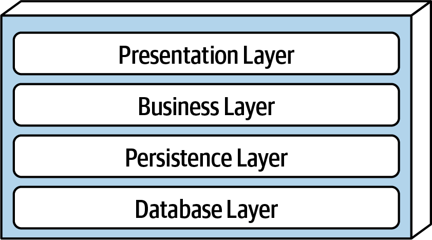{fig-align="center" width="75%"}

- **Separation of concerns**: Componentes en una capa solo saben de la lógica de esa capa. 
- **Layers of isolation**: Modificaciones en una capa no afectan a otras.
- **Partición por criterios tecnológicos**: Capa agrupa componentes por función técnica (presentacion, etc) en vez de por dominio (e.g., clientes).

:::notes

Separation of concerns: Componentes en una capa solo saben de la lógica de esa capa. At the class level, not to mix abstraction levels in the same method; not to mix responsibilities in the same method and class.

Layers of isolation: Modificaciones en una capa no afectan a otras; capas independientes/desacopladas

Partición por criterios tecnólogicos: Componentes, en lugar de agruparse por dominio (como clientes), se agrupan por su función técnica en la arquitectura (presentación, negocio)

Image credits: [@richards2020]
:::

## Monolíticos - Capas (II)

Layered architectures are consequence of applying **separation of concerns** to application structure [@nogueira2022]

- Model View Controller (MVC) 
- Model View Presenter (MVP) 
- [Hexagonal Architecture](https://es.wikipedia.org/wiki/Arquitectura_hexagonal_(software)) 
- Onion Architecture 
- [Clean Architecture](https://blog.cleancoder.com/uncle-bob/2012/08/13/the-clean-architecture.html)

## Monolíticos - Pipeline

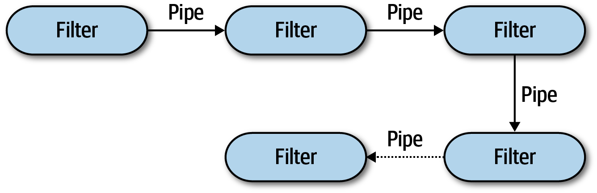{fig-align="center" width="75%"}

Pipes & filters transforman documentos/datos/mensajes de forma concatenada.

:::notes
Image credits: [@richards2020]
:::

## Monolíticos - Pipeline (II) {.smaller}

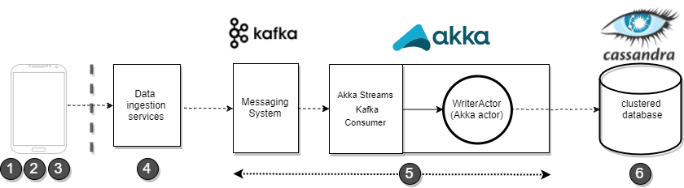{fig-align="center" width="65%"}

> Con respecto a la gestión de datos de entrada en streaming, el primer componente en el paso **5** es un sistema de mensajería basado en [Apache Kafka](https://kafka.apache.org/), que asegura la **recepción, buffer y ruteo** del flujo de datos en streaming. [@rodriguez2021] 

- herramientas ETL (*extract, transform, and load*) 
- cadenas de productor-consumidor de datos
- datos en streaming (telemetría, sensores, etc)

:::notes
"The first component is the (Kafka) messaging system, which ensures reliable handling (receive, buffer, route) of the incoming flow of data. The message system emits and exchanges messages, which contain the metrics data payload, through a Kafka topic to which connector applications can subscribe in order to handle/process the data stream. One such connector application is the self-developed persistence component, which connects to the (Kafka) messaging system and persists the messages in the (Cassandra) database" (pg 89)

Image credits: [@rodriguez2021]

:::

## Monolíticos - Microkernel {.smaller}

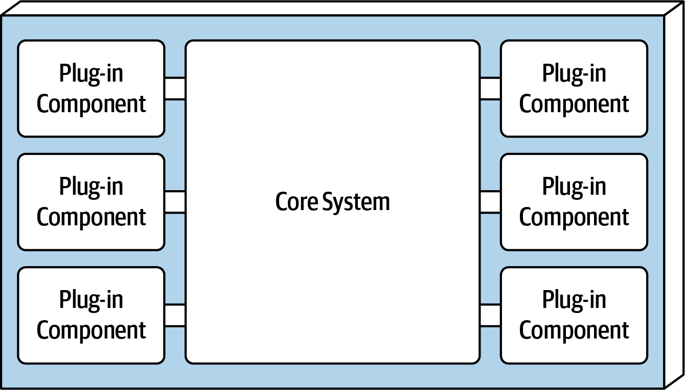{fig-align="center" width="50%"}

- *Core system* es extensible

- *Plug-ins* independientes, encapsulados y autónomos (*standalone*), que se comunican con el sistema via interfaces (REST, pipe, ...)

- Ejemplos: **VSCode** *extensions*, **Jira** *plugins*, **Chrome** *extensions*, **Firefox** *add-ons*, **Alexa** *skills*, etc.

:::notes

*Core system* es la funcional mínima/básica del sistema. Funcionalidad mínima requirida para el sistema básico.

*Plug-ins* son componentes independientes, *standalone* que proporcionan funcionalidad adicional.

Image credits: [@richards2020]
:::

## Monolíticos - Microkernel (II)

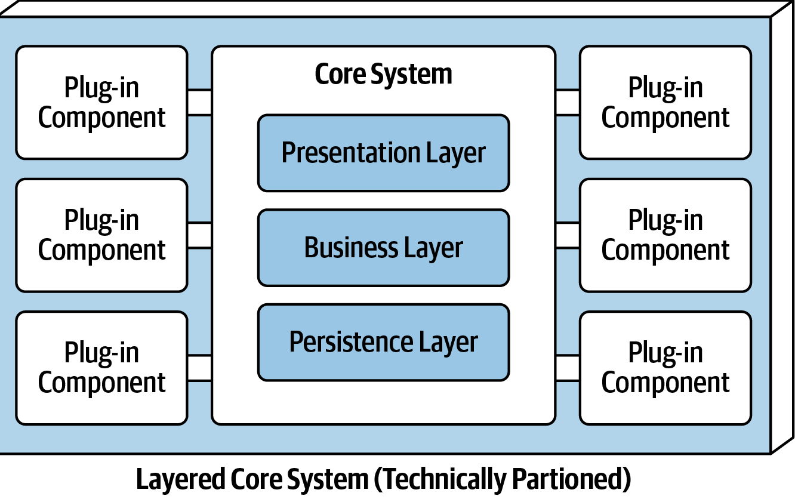{fig-align="center" width="35%"}

Combinación de estilos: *Core System* se organiza como *layered architectura*

:::notes
Image credits: [@richards2020]
:::

## Distribuidos - Event-driven {.smaller}

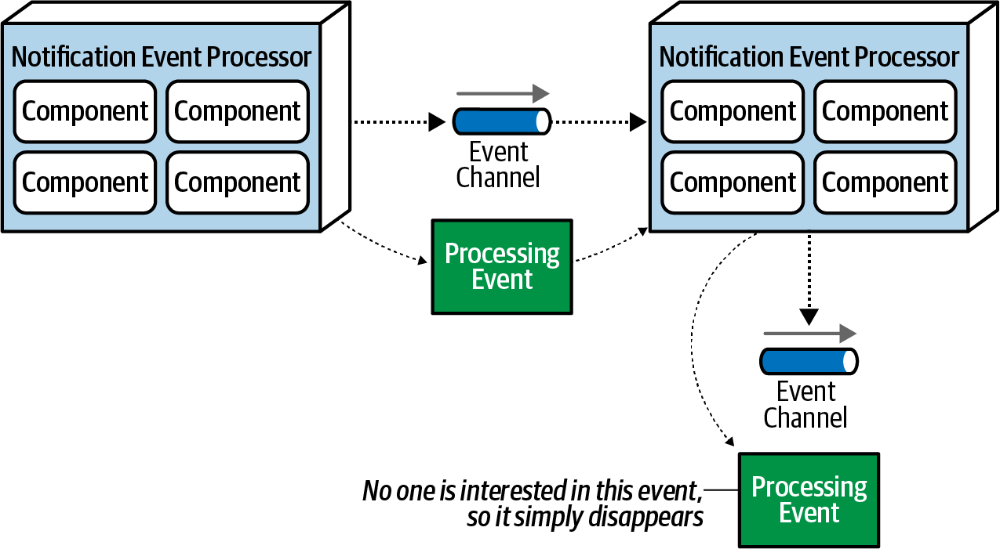{fig-align="center" width="70%"}

- **Evento**: tipo de mensaje que describe lo que está occuriendo en el sistema

- **Productor** emite un evento. **Consumidor** se suscribe a eventos

- EDA promueve **comunicacion asíncronoa de mensajes** (cola eventos) en vez de request/response

- EDA como microservicios basados en eventos asíncronos

:::notes

The core purpose of event-driven architecture (EDA) is that a software design pattern which has a system of loosely coupled microservices which is used event based, both the many events are being published by system and these events are being consumed their subscribes. It is an architecture for distributed systems, that promotes asynchronous message communication rather than a request/response pattern.

- Productor emite un evento/tópico. 
- Consumidor se suscribe a eventos/tópicos. 
- Cola de eventos facilita mensajes asíncronos.

Image credits: [@richards2020]
:::

## Distribuidos - Event-driven (II)

### Broker topology

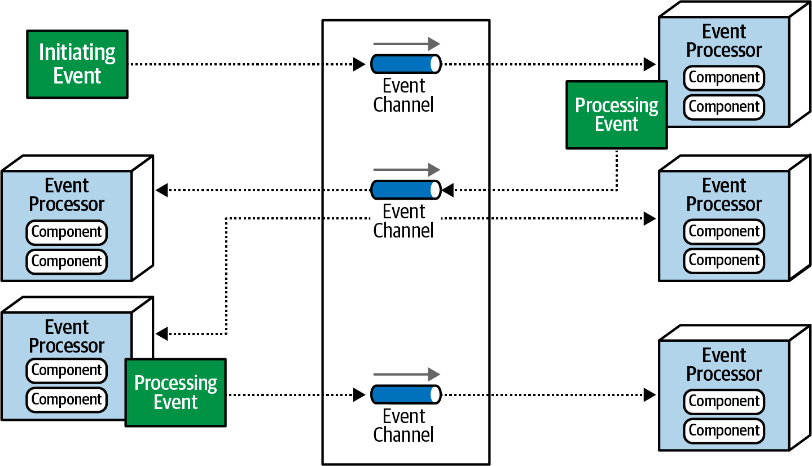{fig-align="center" width="75%"}

:::notes
No hay coordinación centralizada de eventos; 

Broadcasting eventos a multiples suscriptores 

Image credits: [@richards2020]
:::

## Distribuidos - Event-driven (III)

### Mediator topology

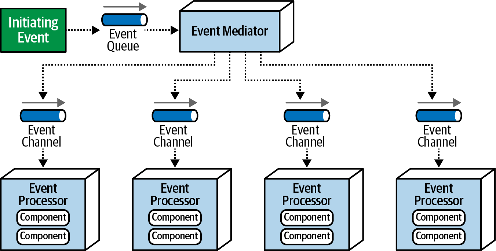{fig-align="center" width="75%"}

:::notes
Image credits: [@richards2020]
:::

## Distribuidos - Event-driven (ejemplos)

- [NativeScript Task Dispatcher](https://github.com/GeoTecINIT/nativescript-task-dispatcher), desarrollado por Alberto González y Miguel Matey [@gonzalez2021], [@gonzalez2022]

- Grafo de tareas cuyas dependencias se gestionan mediante eventos (smartphone) - [Ejemplo](https://github.com/GeoTecINIT/nativescript-task-dispatcher#quick-start)

## Distribuidos - Service-oriented

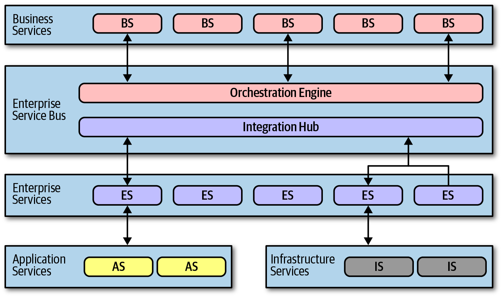{fig-align="center" width="75%"}

:::notes
Image credits: [@richards2020]
:::

## Distribuidos - Microservicios {.smaller}

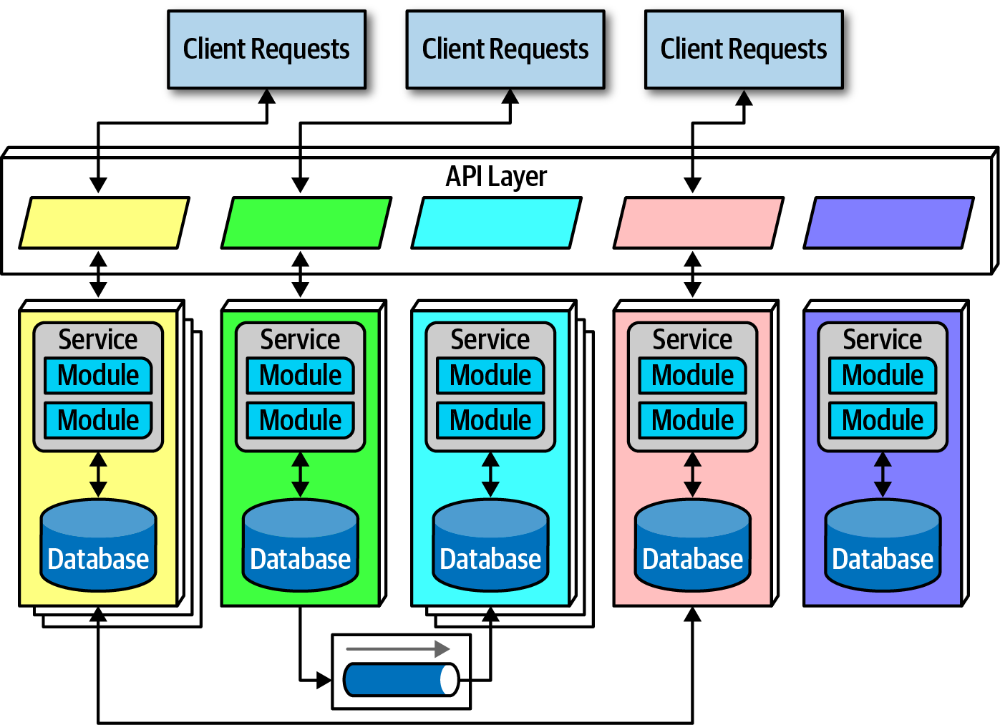{fig-align="center" width="75%"}

- **Domain-driven design** (vs partición técnica)

- **Bounded context**: cada microservicio modela un dominio o workflow

- **Data isolation**: cada microservicio tiene su base de datos y esquema de datos

- Despligue con virtualización/contenerización

:::notes
Image credits: [@richards2020]
:::

## Distribuidos - Microservicios (ejemplo)

Microservicios en [Akka](https://akka.io/) para computación de métricas basadas en mensajes [@rodriguez2021]

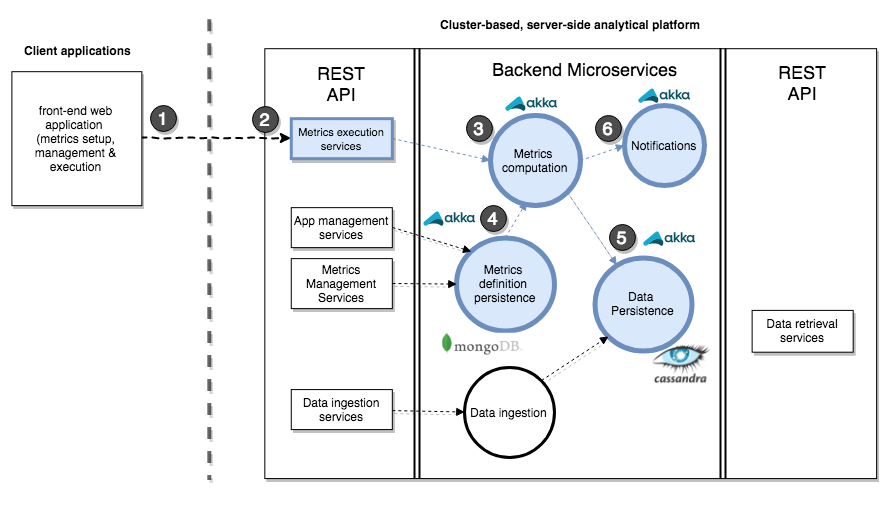{fig-align="center" width="75%"}

# Referencias {.smaller .scrollable}